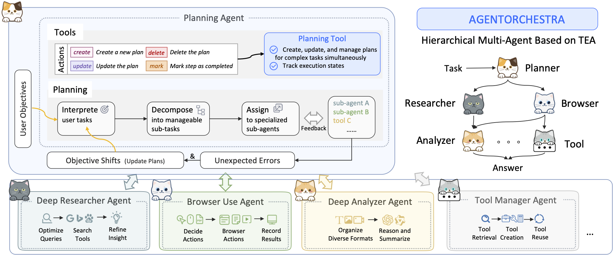

# AgentWorld

A comprehensive framework for building multi-agent systems based on the **TEA Protocol** (Tool-Environment-Agent Protocol), designed to create universal agents capable of handling diverse real-world tasks.

## 🎯 Project Overview

AgentWorld aims to implement universal agents through a unified protocol that standardizes the interaction between tools, environments, and agents. The framework provides a foundation for building various specialized multi-agent systems.

## 🏗️ TEA Protocol Architecture

AgentWorld is built on the **TEA Protocol** (Tool-Environment-Agent Protocol), a unified framework for multi-agent systems:


### What is TEA Protocol?

The TEA Protocol is a comprehensive framework that standardizes the interaction between three core components:

- **T (Tools)**: Comprehensive tool system with 50+ tools across multiple categories
- **E (Environments)**: Specialized environments for different use cases  
- **A (Agents)**: Intelligent agents with async capabilities and coordination

The protocol consists of three main layers:

1. **Infrastructure Layer**: Unified LLM interface and memory system
2. **Core Protocols**: TCP (Tool Context Protocol), ECP (Environment Context Protocol), ACP (Agent Context Protocol)
3. **Protocol Transformations**: Six fundamental transformations enabling seamless resource orchestration:
   - **A2T**: Agent-to-Tool (encapsulate agent capabilities as tools)
   - **T2A**: Tool-to-Agent (designate tools as agent actuators)
   - **E2T**: Environment-to-Tool (convert environment actions to tool interfaces)
   - **T2E**: Tool-to-Environment (elevate tool sets to environment abstractions)
   - **A2E**: Agent-to-Environment (encapsulate agents as interactive environments)
   - **E2A**: Environment-to-Agent (infuse reasoning into environment dynamics)

```
AgentWorld/
├── src/
│   ├── agents/                 # Agent implementations
│   │   ├── tool_calling_agent.py    # Tool-calling agent with async support
│   │   ├── simple_chat_agent.py    # Conversational agent
│   │   ├── debate_manager.py        # Multi-agent debate coordination
│   │   ├── finagent.py             # Financial analysis agent
│   │   ├── prompts/                 # Prompt templates and management
│   │   └── protocol/                # Agent Context Protocol (ACP)
│   ├── environments/           # Specialized environments
│   │   ├── file_system_environment.py    # File operations
│   │   ├── github_environment.py         # GitHub integration
│   │   ├── database_environment.py       # Database operations
│   │   ├── trading_offline_environment.py # Financial trading
│   │   ├── playwright_environment.py    # Browser automation
│   │   ├── faiss_environment.py         # Vector search
│   │   └── protocol/                     # Environment Context Protocol (ECP)
│   ├── tools/                  # Comprehensive tool system
│   │   ├── default_tools/      # Core utilities (web, file, bash, etc.)
│   │   ├── workflow_tools/      # Advanced workflows (research, analysis)
│   │   ├── mcp_tools/          # Model Context Protocol tools
│   │   └── protocol/            # Tool Context Protocol (TCP)
│   ├── infrastructures/        # Core infrastructure
│   │   ├── models/             # Model management (OpenAI, Anthropic, Google)
│   │   └── memory/            # Memory and state management
│   ├── transformation/         # Protocol transformations
│   │   └── protocol/           # TEA protocol transformations
│   ├── supports/              # Supporting utilities
│   │   ├── datasets/          # Data processing
│   │   ├── metric/            # Performance metrics
│   │   └── calen/             # Calendar utilities
│   ├── logger/                # Logging system
│   └── utils/                 # Common utilities
├── configs/                   # Configuration files
├── examples/                  # Usage examples and demos
├── datasets/                  # Sample data
└── tests/                     # Comprehensive test suite
```


## 🤖 AgentOrchestra: A Multi-Agent Instance

**AgentOrchestra** is a hierarchical multi-agent system built on AgentWorld, designed to solve general-purpose tasks through coordinated agent collaboration.



### Key Features

- **🔄 Full Async Architecture**: Complete async/await implementation for optimal performance
- **🤖 Multi-Agent Coordination**: Sophisticated agent orchestration with LangGraph
- **🧠 Unified Model Management**: Support for OpenAI, Anthropic, Google, and custom models
- **🔧 Comprehensive Tool System**: 50+ tools across multiple categories (web, file, browser, research)
- **🌍 Rich Environment Support**: File system, GitHub, database, trading, browser automation
- **📝 Advanced Prompt Management**: Centralized template system with specialized prompts
- **🔍 Deep Research Capabilities**: Multi-round research workflows with multimodal support
- **⚡ High Performance**: Concurrent processing and optimized resource utilization
- **🔌 Extensible Design**: Easy integration of new agents, tools, and environments

### Multi-Agent Systems in AgentWorld

AgentWorld supports various multi-agent implementations:

- **AgentOrchestra**: Hierarchical multi-agent system for general tasks
- **Multi-Agent Debate**: Collaborative debate and discussion systems
- **Code Agent**: Specialized agents for software development tasks
- **Future Additions**:
  - **Computer Game Agent**: Gaming and simulation agents
  - **Mobile Game Agent**: Mobile application and game agents

## 🚀 Quick Start

### Prerequisites

- Python 3.11+
- Git
- API keys for your preferred LLM providers

### Installation

1. **Clone the repository:**
```bash
git clone <repository-url>
cd AgentWorld
```

2. **Install dependencies:**
```bash
pip install -r requirements.txt
cd libs/
git clone git@github.com:browser-use/browser-use.git
cd browser-use
pip install -e .
```

3. **Set up environment variables:**
```bash
# Setup `.env` in your project root path, the keys should be like:
PYTHONWARNINGS=ignore # ignore warnings
ANONYMIZED_TELEMETRY=false # disable telemetry

# OpenAI API Key
OPENAI_API_BASE=https://api.openai.com/v1
OPENAI_API_KEY=abcabcabc
# Anthropic API Key
ANTHROPIC_API_BASE=https://api.anthropic.com
ANTHROPIC_API_KEY=abcabcabc
# Google
GOOGLE_API_BASE="xxx"
GOOGLE_API_KEY="xxx"

#Search API
BRAVE_SEARCH_API_KEY=abcabcabc
FIRECRAWL_API_KEY=abcabcabc
#Github
GITHUB_TOKEN=abcabcabc
GITHUB_USERNAME=your-github-username
```

### 🎯 Basic Usage

**Simple Chat Agent:**
```python
import asyncio
from pathlib import Path
import sys

# Add project root to path
root = str(Path(__file__).resolve().parents[1])
sys.path.append(root)

from src.config import config
from src.logger import logger
from src.infrastructures.models import model_manager
from src.agents import acp

async def main():
    # Initialize configuration
    config.init_config("configs/simple_chat_agent.py")
    logger.init_logger(config)
    
    # Initialize models and agents
    # use_local_proxy = False, will use the official openai api
    await model_manager.initialize(use_local_proxy=config.use_local_proxy)
    await acp.initialize(config.agent_names)
    
    # Run simple chat
    result = await acp.ainvoke(
        name="simple_chat",
        input={"task": "Hello, how are you?"}
    )
    print(result)

asyncio.run(main())
```

**Tool-Calling Agent:**
```python
import asyncio
from pathlib import Path
import sys

root = str(Path(__file__).resolve().parents[1])
sys.path.append(root)

from src.config import config
from src.logger import logger
from src.infrastructures.models import model_manager
from src.tools import tcp
from src.agents import acp

async def main():
    # Initialize with tool-calling configuration
    config.init_config("configs/tool_calling_agent.py")
    logger.init_logger(config)
    
    # Initialize all systems
    await model_manager.initialize(use_local_proxy=config.use_local_proxy)
    await tcp.initialize(config.tool_names)
    await acp.initialize(config.agent_names)
    
    # Run tool-calling agent
    result = await acp.ainvoke(
        name="tool_calling",
        input={"task": "Search for the latest AI news and summarize it"}
    )
    print(result)

asyncio.run(main())
```

## 🎮 Running Examples

### AgentOrchestra Examples
```bash
# Simple chat agent
python examples/run_simple_chat_agent.py

# Tool-calling agent with full capabilities
python examples/run_tool_calling_agent.py
```

### Multi-Agent Systems
```bash
# Multi-agent debate system
cd examples/debate
python debate_frontend.py
```

## 🧪 Testing

```bash
# Test tools
python tests/test_tcp.py

# Test agents
python tests/test_acp.py
```

## 🤝 Contributing

1. **Fork the repository**
2. **Create a feature branch**: `git checkout -b feature/your-feature-name`
3. **Make your changes**: Prefer async implementations for consistency
4. **Add tests**: Ensure your changes are properly tested
5. **Submit a pull request**: Include a clear description of your changes

## 📄 License

MIT License - see [LICENSE](LICENSE) file for details.

---

**AgentWorld** - A universal framework for building multi-agent systems through the TEA Protocol, with AgentOrchestra as a prime example of hierarchical multi-agent coordination.