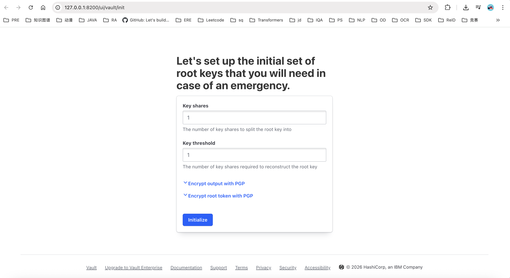
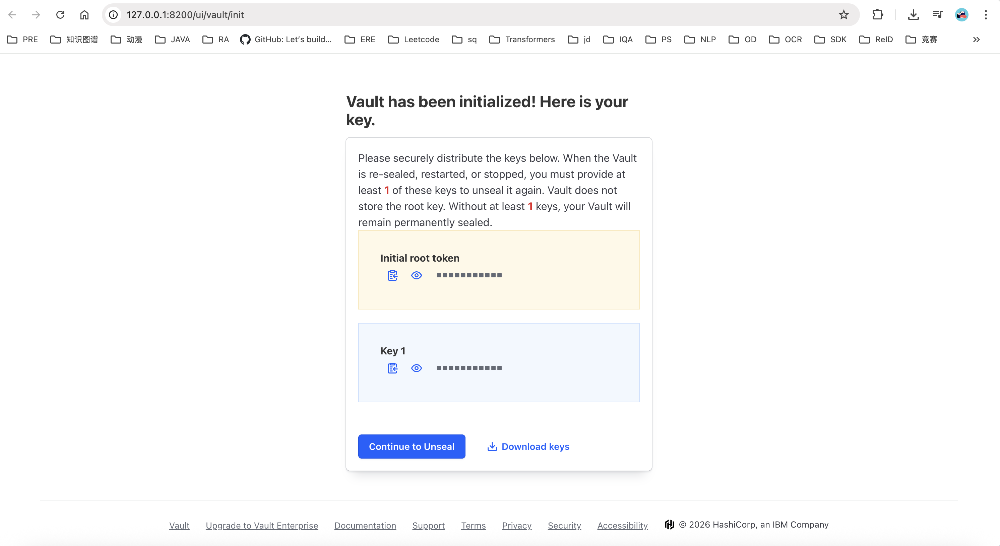
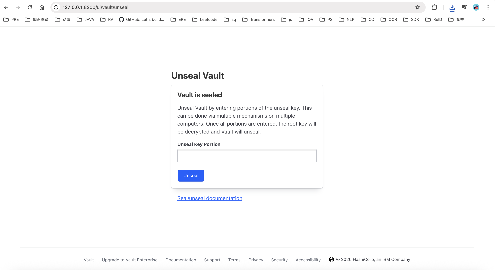
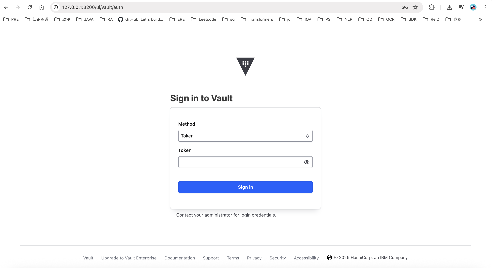
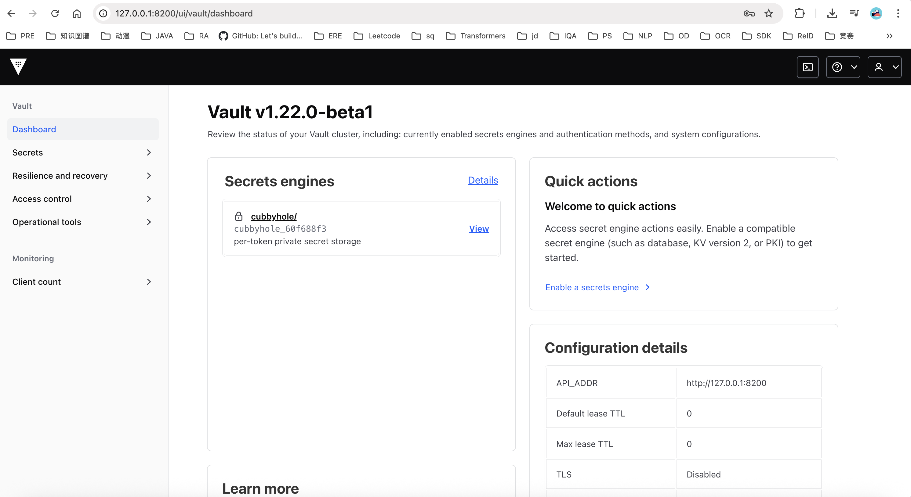
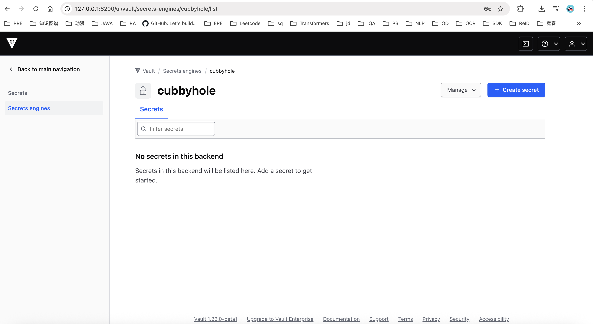
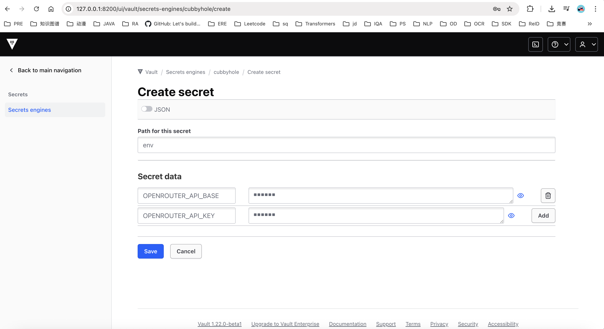

# 1. Install API Key Management Software

## Step 1:

```bash
# If already installed, start the service directly
vault server -config=/mnt/agent-framework/<your user path>/myapp/vault/config/vault.hcl > /mnt/agent-framework/<your user path>/myapp/vault/vault.log 2>&1 &

cd scripts
chmod +x install_vault.sh 
./install_vault.sh /mnt/agent-framework/<your user path>/myapp
# This starts the service at http://127.0.0.1:8200 by default.
# VSCode's remote port forwarding will map the port automatically,
# so just click the VSCode popup window to open http://127.0.0.1:8200 in the browser.
```

## Step 2: Set the number of login verification keys to 1
Set **Key shares** to **1**, **Key threshold** to **1**, then click **Initialize**.


## Step 3:
You will see two keys: **Initial root token** and a login verification key **key1**. Make sure to record them! You can also download them locally by clicking **Download Keys** to save the JSON file.

It is recommended to put the **Initial root token** in the `.env` file at the project root:
```bash
VAULT_ADDR='http://127.0.0.1:8200'
VAULT_TOKEN=<Initial root token>
SECRET_ENGINE_PATH='cubbyhole/env'
```



Then click **Continue to Unseal**.

## Step 4:
Enter **key1** as the key.


## Step 5:
Enter the **Initial root token** as the key.


## Step 6:
Login is successful. You will see a secrets engine **cubbyhole/**. Click **View**.


## Step 7:
Click **Create secret**, set the path to **env** — this corresponds to **SECRET_ENGINE_PATH='cubbyhole/env'** in the `.env` file.


## Step 8:
Enter key-value pairs and click **Save** to finish the configuration.


The required keys are:
```bash
OPENROUTER_API_BASE=...
OPENROUTER_API_KEY=...
OPENAI_API_BASE=...
OPENAI_API_KEY=...
NEWAPI_API_BASE=...
NEWAPI_API_KEY=...
```

## Step 9: Verify the configuration
```bash
export VAULT_ADDR='http://127.0.0.1:8200'
export VAULT_TOKEN='your Initial root token'
vault kv get -field=OPENROUTER_API_KEY cubbyhole/env

# Expected output — your OPENROUTER_API_KEY value:
abcabc...
```

# 2. Install opencode

If you have already installed opencode, just make sure the `opencode.json` file is correct:

```bash
vim /mnt/agent-framework/<your user path>/myapp/opencode/opencode.json
```

```json
{
  "$schema": "https://opencode.ai/config.json",
  "permission": {
    "bash": "allow",
    "edit": "allow",
    "write": "allow"
  },
  "provider": {
    "openrouter": {
      "options": {
        "baseURL": "${OPENROUTER_API_BASE}",
        "apiKey": "${OPENROUTER_API_KEY}"
      },
      "models": {
        "anthropic/claude-opus-4.6": {}
      }
    },

    "newapi": {
      "options": {
        "baseURL": "${NEWAPI_API_BASE}",
        "apiKey": "${NEWAPI_API_KEY}"
      },
      "models": {
        "claude-opus-4-6": {}
      }
    },

    "openai": {
      "options": {
        "baseURL": "${OPENAI_API_BASE}",
        "apiKey": "${OPENAI_API_KEY}"
      },
      "models": {
        "gpt-5.4": {},
        "gpt-5.4-pro": {}
      }
    }
  },
  "model": "newapi/claude-opus-4-6"
}
```

## Step 1:

```bash
cd scripts
chmod +x install_opencode.sh 
./install_opencode.sh /mnt/agent-framework/<your user path>/myapp
```

## Step 2: Verify the configuration
```bash
opencode run 'hello world'

# If you see output similar to the following, the setup is successful:

> build · anthropic/claude-opus-4.6

Hello! How can I help you today? If you need assistance with a software engineering task, feel free to describe what you're working on.
```

# 3. Set Up Python Environment

## Step 1:
```bash
conda create -n agentos python=3.11
conda activate agentos
pip install -r requirements.txt
```

## Step 2:

Ensure your `.env` file contains the following:
```bash
VAULT_ADDR='http://127.0.0.1:8200'
VAULT_TOKEN=abcabcabc
SECRET_ENGINE_PATH='cubbyhole/env'
```

## Step 3: Run a quick test
```bash
# Download HLE dataset
cd datasets
git clone https://huggingface.co/datasets/cais/hle
cd ..

# Run example
python examples/run_hle.py
```

## Parameter Reference

| Parameter | Type | Default | Description |
|-----------|------|---------|-------------|
| `--config` | str | `configs/bus.py` | Path to the configuration file |
| `--model-name` | str | `openrouter/gemini-3.1-pro-preview` | Model name used for direct inference mode |
| `--use-bus` | flag | `False` | Enable the AgentBus full agent pipeline (default: direct LLM inference) |
| `--max-concurrency` | int | `4` | Maximum number of concurrent tasks |
| `--max-rounds` | int | `10` | Maximum planning rounds per task in Bus mode |
| `--start` | int | `None` | Start index (inclusive) of the HLE dataset subset |
| `--end` | int | `None` | End index (exclusive) of the HLE dataset subset |
| `--cfg-options` | list | - | Override config entries in `key=value` format |


# 4. SkillsBench

SkillsBench is a multi-turn interactive benchmark containing 87 tasks running inside Docker containers. The agent sends shell commands, receives stdout/stderr feedback, and is evaluated by `test.sh` (reward: 0.0–1.0).

## Prerequisites

1. Install Docker and ensure the current user has Docker permissions.
2. Initialize the SkillsBench submodule and install dependencies:

```bash
git submodule update --init -- src/benchmark/skillsbench-sandbox/skillsbench

pip install gymnasium pyyaml
```

## Start the Sandbox Server

```bash
python src/benchmark/skillsbench-sandbox/start_sandbox_server.py --config src/benchmark/skillsbench-sandbox/sandbox_config.yaml
```

Health check:

```bash
curl -s http://127.0.0.1:8080/health
```

## Run

```bash
# Direct LLM inference (multi-turn shell interaction)
python examples/run_skillsbench.py --model-name openrouter/gemini-3.1-pro-preview

# Bus mode (AgentOS full agent pipeline)
python examples/run_skillsbench.py --use-bus
```

## SkillsBench Parameter Reference

| Parameter | Type | Default | Description |
|-----------|------|---------|-------------|
| `--config` | str | `configs/bus.py` | Path to the configuration file |
| `--model-name` | str | `openrouter/gemini-3.1-pro-preview` | Model name used for direct inference mode |
| `--use-bus` | flag | `False` | Enable the AgentBus full agent pipeline |
| `--server-url` | str | `http://127.0.0.1:8080` | Sandbox server address |
| `--dataset` | str | `tasks` | Dataset name (tasks, tasks-no-skills, etc.) |
| `--task-id` | str | `None` | Run a single task (e.g., xlsx-recover-data) |
| `--max-concurrency` | int | `4` | Maximum number of concurrent tasks |
| `--max-steps` | int | `None` | Override max steps per task (default inferred from difficulty) |
| `--max-rounds` | int | `20` | Maximum planning rounds per task in Bus mode |
| `--step-timeout` | int | `None` | Override per-step execution timeout (seconds) |
| `--start` | int | `None` | Start index (inclusive) of the task subset |
| `--end` | int | `None` | End index (exclusive) of the task subset |
| `--resume` | flag | `False` | Resume from the latest result file |
| `--filter` | str | `None` | Used with --resume: `wrong` reruns failed tasks, `null` reruns tasks with no result |
| `--disable-skill-injection` | flag | `False` | Disable skill metadata injection into the agent prompt |
| `--cfg-options` | list | - | Override config entries in `key=value` format |

# 5. Miscellaneous

```bash
# 1. Test model API calls
curl -X POST "https://xxx/v1/responses" \
  -H "Content-Type: application/json" \
  -H "Authorization: Bearer xxx" \
  -d '{
    "model": "gpt-5.4-pro",    
    "input": "hello",
    "max_output_tokens": 2048
  }'

curl -X POST "https://xxx/v1/chat/completions" \
  -H "Content-Type: application/json" \
  -H "Authorization: Bearer xxx" \
  -d '{
  "model": "openai/gpt-5.4",
  "messages": [
    {
      "role": "user",
      "content": "Hello"
    }
  ],
  "temperature": 0.7,
  "max_tokens": 2048
}'
```

```bash
# 1. Install gcloud
curl https://sdk.cloud.google.com | bash
gcloud init
gcloud auth application-default login
gcloud config set project YOUR_PROJECT_ID # Get your project ID from https://console.cloud.google.com/
gcloud auth application-default set-quota-project YOUR_PROJECT_ID
```

```bash
# 1. Install Playwright
pip install playwright
playwright install

# 2. Install browser-use
pip install browser-use
browser-use install
```
